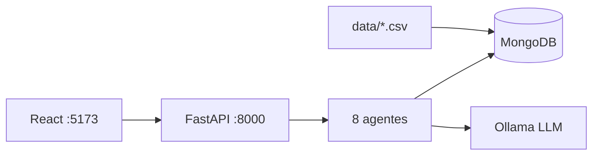

# Sistema Multi-Agente — Detección de Fraude (BCP)

Web app para detectar fraude en transacciones con señales ambiguas: **8 agentes**, **FastAPI**, **React**, **MongoDB** y **Ollama** (LLM local).

**Este README es la única guía necesaria** para clonar el repo, levantar el entorno y presentar el demo.

---

## Demo en 5 minutos

### Requisitos

| Herramienta | Versión | Notas |
|-------------|---------|-------|
| Docker | reciente | MongoDB local |
| Python | 3.11+ | Backend |
| Node.js | 20+ | Frontend |
| Ollama | latest | **LLM local** — lo instala `demo-init.sh` si falta (macOS+Homebrew o Linux) |
| Git | cualquiera | Clone del repo |

### Paso 1 — Clonar e inicializar (automático)

```bash
git clone <URL-DEL-REPO> reto-fraud-detection
cd reto-fraud-detection

chmod +x scripts/demo-init.sh
./scripts/demo-init.sh
```

El script hace:

1. Crea `.env` y `web/.env` desde los `.example` (si no existen)
2. Levanta MongoDB con Docker
3. Instala backend (venv + pip)
4. **Carga datos demo** (`transactions`, perfiles de cliente, merchants)
5. Instala dependencias del frontend (`npm install`)
6. **Instala Ollama** si no está (Homebrew en macOS, script oficial en Linux)
7. **Descarga el modelo** `qwen2.5:7b-instruct` (puede tardar varios minutos la primera vez)

> **No subas `.env` al repo** — ya está en `.gitignore`. Solo se commitean `.env.example`.

#### Instalar Ollama manualmente (si `demo-init.sh` no pudo)

| SO | Comando |
|----|---------|
| **macOS** (Homebrew) | `brew install ollama` |
| **macOS / Windows** | Descarga: [ollama.com/download](https://ollama.com/download) |
| **Linux** | `curl -fsSL https://ollama.com/install.sh \| sh` |

Luego arranca el servidor y descarga el modelo:

```bash
# macOS: abre la app Ollama, o en terminal:
ollama serve

# Descargar modelo (una sola vez, ~4 GB)
ollama pull qwen2.5:7b-instruct
```

Verifica:

```bash
ollama list
curl http://localhost:11434/api/tags
```

### Paso 2 — Dos terminales (backend + frontend)

Ollama ya debería estar corriendo tras el paso 1. Si no:

```bash
# macOS
open -a Ollama
# o
ollama serve
```

**Terminal 1 — Backend:**

```bash
cd backend
source .venv/bin/activate          # Windows: .venv\Scripts\activate
uvicorn app.main:app --reload --port 8000
```

**Terminal 2 — Frontend:**

```bash
cd web
npm run dev
```

Abre **[http://localhost:5173](http://localhost:5173)**

### Paso 3 — Verificar que todo responde

```bash
curl http://localhost:8000/health
cd backend && source .venv/bin/activate && python -m scripts.validate_ollama
```

---

## Guión de presentación (10–15 min)

### Transacciones demo (4 decisiones obligatorias)

| ID | Decisión esperada | Por qué |
|----|-------------------|---------|
| **T-1003** | APPROVE | Monto y horario habituales |
| **T-1001** | CHALLENGE | FP-01 — monto alto + horario raro |
| **T-1004** | BLOCK | FP-03 + merchant alto riesgo |
| **T-1005** | ESCALATE_TO_HUMAN | FP-02 — país + dispositivo nuevos |

### Flujo recomendado en la UI

| # | Página | Qué mostrar |
|---|--------|-------------|
| 1 | **Transactions** (`/transactions`) | 5 transacciones seed (T-1001…T-1005). Clic **Evaluate all pending** (~5–8 min con Ollama). Botón **Cancel** si necesitas abortar la espera. |
| 2 | **Evaluation** (`/evaluations/T-1003`) | APPROVE — sin señales, pipeline verde, explicación al cliente en español. |
| 3 | **Evaluation** (`/evaluations/T-1001`) | CHALLENGE — señales FP-01, debate Pro-Fraud vs Pro-Customer. |
| 4 | **Evaluation** (`/evaluations/T-1004`) | BLOCK — políticas FP-03/FP-04, riesgo alto. |
| 5 | **Evaluation** (`/evaluations/T-1005`) | ESCALATE — dispositivo/país atípicos. |
| 6 | **HITL Queue** (`/hitl`) | Casos auto-creados (T-1004, T-1005). Resolver con APPROVED / REJECTED / ESCALATED. |
| 7 | **Audit Trail** (`/audit/T-1004`) | Umbrales FP-*, perfil vs baseline, pass/fail por agente, eventos HITL. |
| 8 | **Insert** (`/insert`) | *(opcional)* Insertar SIM-* y evaluar una transacción nueva. |

### Qué destacar

- **8 agentes**: Context → Behavior → Policy RAG → Web Intel → Aggregation → Debate → Arbiter → Explainability.
- **HITL**: cola humana cuando `ESCALATE_TO_HUMAN` o riesgo ≥ 50%.
- **Audit trail**: trazabilidad forense — no solo la decisión, sino *cómo* se llegó.

---

## Antes de una demo limpia

MongoDB arranca **vacío**; los datos entran con el seed. Las evaluaciones se acumulan al evaluar.

```bash
cd backend && source .venv/bin/activate

# Borra evaluaciones, audit y HITL (mantiene transacciones seed)
python -m scripts.reset_evaluations

# Opcional: re-evaluar las 4 demos por CLI (~4 min con Ollama)
python -m scripts.reevaluate_demo
```

| Colección | ¿Se borra con reset? | Origen |
|-----------|----------------------|--------|
| `transactions`, `customer_behaviors` | No | `data/*.csv` vía `seed_data` |
| `evaluations`, `audit_events`, `hitl_cases` | Sí (`reset_evaluations`) | Al evaluar en UI o API |
| Políticas FP-* | No en Mongo | `data/fraud_policies.json` en runtime |

Volver a cargar datos seed:

```bash
python -m scripts.seed_data    # idempotente (upsert)
```

---

## Base de datos — de cero a demo

```text
docker compose up -d mongo     →  MongoDB vacío
./scripts/demo-init.sh         →  seed desde data/transactions.csv + customer_behavior.csv
Evaluate en UI                 →  evaluations + audit_events + hitl_cases
```

Archivos fuente (incluidos en el repo):

```
data/transactions.csv
data/customer_behavior.csv
data/fraud_policies.json
data/merchants.json
data/high_risk_merchants.json
```

Opcional: `SEED_ON_STARTUP=true` en `.env` ejecuta el seed al arrancar el backend.

---

## Variables de entorno

```bash
cp .env.example .env
cp web/.env.example web/.env
```

| Archivo | ¿Subir a Git? |
|---------|---------------|
| `.env.example`, `web/.env.example` | ✅ Sí |
| `.env`, `web/.env` | ❌ Nunca |

| Variable | Default | Uso |
|----------|---------|-----|
| `MONGODB_URI` | `mongodb://localhost:27017/fraud_detection` | MongoDB |
| `LLM_MOCK` | `false` | `true` = sin Ollama (texto fijo, más rápido) |
| `OLLAMA_MODEL` | `qwen2.5:7b-instruct` | Modelo local |
| `LLM_TIMEOUT_SECONDS` | `120` | Timeout por llamada LLM |
| `WEB_SEARCH_MOCK` | `true` | Intel externa simulada |
| `HITL_CONFIDENCE_THRESHOLD` | `0.5` | Cola HITL si riesgo ≥ 50% |
| `VITE_API_URL` | `http://localhost:8000` | URL backend (`web/.env`) |

---

## Sin Ollama (demo rápido)

```bash
# En .env
LLM_MOCK=true
```

Reinicia el backend. Evaluaciones en segundos con texto mock.

---

## Solución de problemas

| Problema | Solución |
|----------|----------|
| No hay transacciones | `./scripts/demo-init.sh` o `python -m scripts.seed_data` |
| Evaluate tarda / timeout | `ollama serve`; subir `LLM_TIMEOUT_SECONDS=180` |
| Error 500 en evaluate | Revisa Ollama; o `LLM_MOCK=true` |
| CORS / fetch failed | Backend `:8000`, `CORS_ORIGINS=http://localhost:5173` |
| Audit 404 | Evalúa la transacción primero |
| MongoDB no conecta | `docker compose up -d mongo` |

---

## Tests

```bash
./scripts/run-all-tests.sh
```

---

## Publicar en GitHub

```bash
git init
git add .
git status    # .env NO debe aparecer
git commit -m "BCP multi-agent fraud detection demo"
git remote add origin git@github.com:<user>/<repo>.git
git push -u origin main
```

Enviar enlace a: **enriqueinca@bcp.com.pe**

---

## Arquitectura (resumen)



| Capa | Tecnología |
|------|------------|
| Backend | Python 3.11+, FastAPI |
| Frontend | React 18, Vite, Tailwind |
| DB | MongoDB 7 (Docker) |
| LLM local | Ollama |
| Políticas | `data/fraud_policies.json` |

---

## Documentación adicional (opcional)

| Archivo | Contenido |
|---------|-----------|
| [backend/README.md](backend/README.md) | API, agentes, scripts |
| [web/README.md](web/README.md) | Detalle de páginas UI |
| [CHECKLIST.md](CHECKLIST.md) | PDF vs implementado |
| [examples/evaluations/README.md](examples/evaluations/README.md) | Exportar informes JSON |

---

## Limitaciones conocidas

- Orquestación secuencial (LangGraph planificado).
- RAG por reglas JSON, no vectorial.
- Web search mock; Azure OpenAI stub.
- Infra Azure / CI — documentado, no desplegado.
