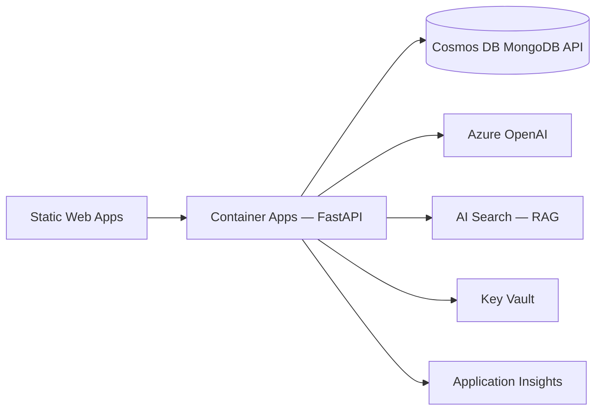

# Infra — Azure (planned)

Infrastructure-as-code and cloud deployment for production. **Local development uses Docker Compose (MongoDB only) — no Bicep required.**

---

## Current status

| Component | Status |
|-----------|--------|
| `docker-compose.yml` (MongoDB) | ✅ Ready |
| `backend/Dockerfile` | ❌ Not yet |
| `infra/main.bicep` | ❌ Not yet |
| `infra/modules/*.bicep` | ❌ Not yet |
| GitHub Actions CI/CD | ❌ Not yet |
| Azure demo URL | ❌ Not yet |

---

## Local infrastructure (today)

```bash
# From repo root
docker compose up -d mongo
docker compose ps
docker compose down        # stop
docker compose down -v     # stop + delete data volume
```

MongoDB: `mongodb://localhost:27017/fraud_detection`

---

## Target Azure architecture



| Module (planned) | Azure service |
|------------------|---------------|
| `cosmos-mongodb.bicep` | Cosmos DB for MongoDB |
| `container-app.bicep` | Container Apps (API) |
| `static-web-app.bicep` | Static Web Apps (React) |
| `ai-search.bicep` | AI Search index |
| `key-vault.bicep` | Secrets |
| `app-insights.bicep` | Observability |
| `container-registry.bicep` | ACR |

---

## Planned deployment

```bash
# When Bicep exists:
az deployment group create \
  -g rg-fraud-detection-prod \
  -f infra/main.bicep \
  -p infra/parameters/prod.bicepparam
```

Post-deploy smoke:

```bash
curl -f https://<api>/health
curl -f -X POST https://<api>/api/transactions/T-1003/evaluate
```

---

## Validation (local)

```bash
./infra/tests/validate-modules.sh
```

Skips Bicep compile if `infra/main.bicep` does not exist yet.

When available:

```bash
az bicep build --file infra/main.bicep
az bicep lint --file infra/main.bicep
```

---

## Environment mapping (local → Azure)

| Component | Local | Azure |
|-----------|-------|-------|
| Database | MongoDB Docker | Cosmos DB MongoDB API |
| LLM | Ollama | Azure OpenAI |
| RAG | JSON policy rules | AI Search vectors |
| Web search | Mock | Tavily + whitelist |
| Frontend | Vite dev server | Static Web Apps |
| Secrets | `.env` (gitignored) | Key Vault |

---

## References

- [Root README](../README.md)
- [azure-deploy.md](../.cursor/skills/reto-tecnico/azure-deploy.md) — deployment guide (when ready)
- `.cursor/rules/azure-architecture.mdc`
- `.cursor/rules/azure-cicd.mdc`
