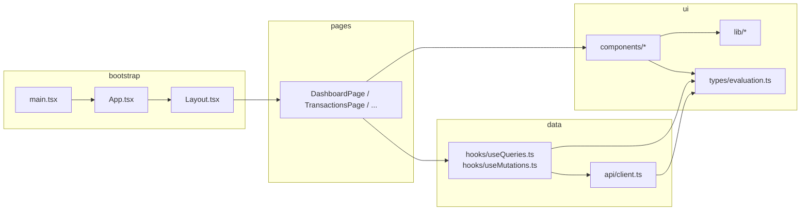
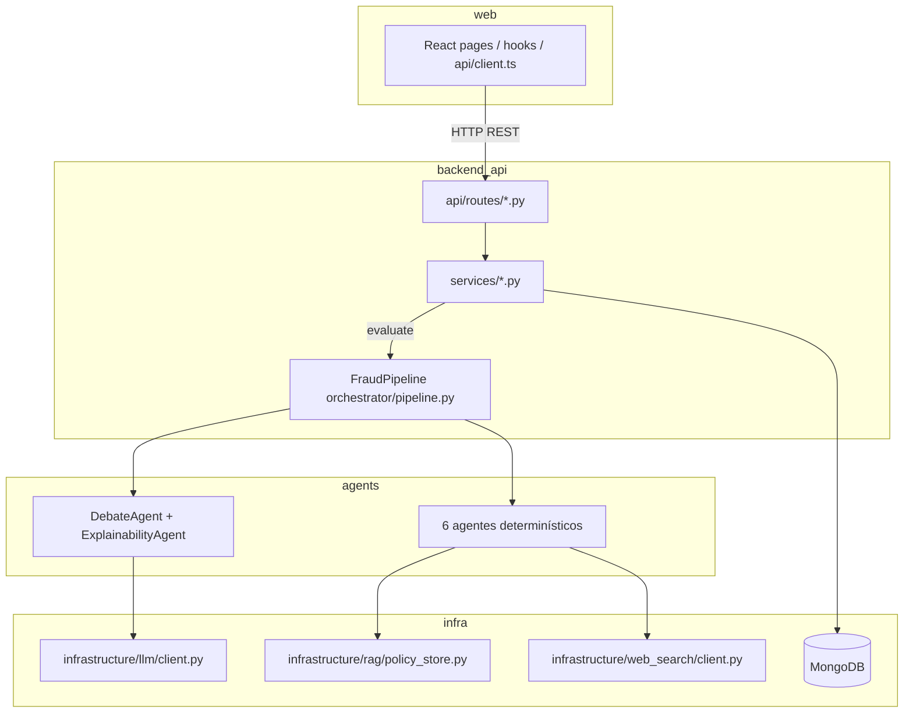

# Web — README técnico

> **Setup rápido:** ver también el [README raíz](../README.md) para levantar backend + frontend juntos.

SPA en **React 18 + TypeScript + Vite** para el sistema multi-agente de detección de fraude BCP. Este documento mapea **cada parte de la aplicación web** a su **código fuente frontend**, al **backend FastAPI** que consume y al **uso de LLM** (Ollama/Azure) cuando aplica.

---

## Stack y configuración

| Pieza | Librería / herramienta | Archivo de referencia |
|-------|------------------------|----------------------|
| UI | React 18 + TypeScript | `package.json` |
| Build / dev server | Vite 6 | `vite.config.ts` |
| Routing | React Router 6 | `src/App.tsx`, `src/main.tsx` |
| Estado servidor | TanStack Query v5 | `src/main.tsx`, `src/hooks/` |
| HTTP | `fetch` (wrapper propio) | `src/api/client.ts` |
| Estilos | Tailwind CSS 3 | `src/index.css`, `tailwind.config.js` |
| Alias de imports | `@/` → `src/` | `vite.config.ts` → `resolve.alias` |
| Tests | Vitest + Testing Library + MSW | `vite.config.ts` → `test`, `src/test/` |
| Variables de entorno | `VITE_API_URL` | `.env.example`, `src/api/client.ts` |

```bash
cd web && cp .env.example .env && npm install && npm run dev
# → http://localhost:5173
```

---

## Arquitectura de capas

Flujo obligatorio (sin `fetch` en páginas ni componentes):

```
Page  →  Hook (TanStack Query)  →  api/client.ts  →  FastAPI backend
  ↓
Components (UI pura: props in / events out)
  ↓
lib/ (funciones puras: formatters, reglas de visualización)
```

Convención definida en `.cursor/rules/web-frontend.mdc`.



---

## Punto de entrada y routing

### Bootstrap — `src/main.tsx`

Monta la app con tres providers:

| Provider | Rol |
|----------|-----|
| `QueryClientProvider` | Cache de servidor (`staleTime: 30s`, sin refetch al foco) |
| `BrowserRouter` | Routing del lado cliente |
| `StrictMode` | Modo estricto de React |

### Rutas — `src/App.tsx`

| Ruta | Página | Visible en nav |
|------|--------|----------------|
| `/` | `pages/DashboardPage.tsx` | Sí |
| `/transactions` | `pages/TransactionsPage.tsx` | Sí |
| `/insert` | `pages/InsertPage.tsx` | Sí |
| `/simulator` | Redirect → `/insert` | No (legacy) |
| `/evaluations/:transactionId` | `pages/EvaluationPage.tsx` | No (enlace desde Transactions/Audit) |
| `/hitl` | `pages/HitlPage.tsx` | Sí |
| `/audit`, `/audit/:transactionId` | `pages/AuditPage.tsx` | Sí |

### Shell — `src/components/Layout.tsx`

- Header con branding BCP y navegación (`NavLink` de React Router).
- `<Outlet />` renderiza la página activa.
- Links definidos en el array `links` (líneas 3–9).

---

## Capa API — `src/api/client.ts`

Único punto HTTP. Base URL: `import.meta.env.VITE_API_URL ?? "http://localhost:8000"`.

| Método `api.*` | HTTP | Endpoint backend | Tipo de retorno (`types/evaluation.ts`) |
|----------------|------|------------------|----------------------------------------|
| `getHealth()` | GET | `/health` | `HealthStatus` |
| `listTransactions()` | GET | `/api/transactions` | `Transaction[]` |
| `evaluateTransaction(id)` | POST | `/api/transactions/{id}/evaluate` | `EvaluationResult` |
| `evaluatePendingTransactions(signal?)` | POST | `/api/transactions/evaluate-pending` | `BulkEvaluateResult` |
| `getEvaluation(id)` | GET | `/api/evaluations/{id}` | `EvaluationResult` |
| `getHitlQueue()` | GET | `/api/hitl/queue` | `HitlCase[]` |
| `resolveHitlCase(id, action, note?)` | POST | `/api/hitl/{id}/resolve` | `HitlCase` |
| `getAuditTrail(id)` | GET | `/api/audit/{id}` | `AuditEvent[]` |
| `getSimulatorScenarios()` | GET | `/api/simulator/scenarios` | `SimulatorScenario[]` |
| `getSimulatorStatus()` | GET | `/api/simulator/status` | `SimulatorStatus` |
| `insertTransaction(templateId)` | POST | `/api/simulator/insert/{templateId}` | `SimulatorInsertResult` |
| `insertNextTransaction()` | POST | `/api/simulator/insert-next` | `SimulatorInsertResult` |

Errores:

- `ApiError` — respuesta HTTP no OK (incluye `status` y mensaje del backend).
- `ApiAbortError` — petición cancelada vía `AbortSignal` (bulk evaluate).

---

## Backend y LLM — qué usa cada parte de la web

La web **no llama al LLM directamente**. Solo consume la API FastAPI (`VITE_API_URL`). El backend ejecuta agentes, persiste en MongoDB y — solo en evaluación — invoca Ollama/Azure vía `LlmClient`.



Arquitectura backend: `backend/app/` — ver [backend/README.md](../backend/README.md).

### Mapa web → backend (ruta → servicio → persistencia)

| Acción en la web | `api/client.ts` | Route backend | Servicio | MongoDB / infra | ¿Usa LLM? |
|------------------|-----------------|---------------|----------|-----------------|-----------|
| Dashboard: estado API | `getHealth()` | `api/routes/health.py` | ping directo a DB | — | No |
| Dashboard / Transactions: listar | `listTransactions()` | `api/routes/transactions.py` | `FraudService.list_transactions()` | `transactions` + `evaluations` (flag `evaluated`) | No |
| **Evaluate** (una fila) | `evaluateTransaction()` | `POST …/evaluate` | `FraudService.evaluate()` → `FraudPipeline.run()` | escribe `evaluations`, `audit_events`; puede crear `hitl_cases` | **Sí** |
| **Evaluate all pending** | `evaluatePendingTransactions()` | `POST …/evaluate-pending` | `FraudService.evaluate_pending()` (loop de `evaluate`) | igual que evaluate | **Sí** (N × pipeline) |
| Ver informe | `getEvaluation()` | `api/routes/evaluations.py` | `FraudService.get_evaluation()` | lectura `evaluations` | No (lee resultado ya generado) |
| Cola HITL | `getHitlQueue()` | `api/routes/hitl.py` | `HitlService.list_queue()` | `hitl_cases` | No |
| Resolver HITL | `resolveHitlCase()` | `POST …/resolve` | `HitlService.resolve()` | actualiza `hitl_cases` + `audit_events` | No |
| Audit trail | `getAuditTrail()` | `api/routes/audit.py` | `AuditService.get_trail()` | `audit_events` | No |
| Insert / escenarios | `getSimulatorScenarios()`, `insert*` | `api/routes/simulator.py` | `SimulatorService` | inserta en `transactions` + evento audit | **No** |

Inyección de dependencias: `backend/app/core/dependencies.py` — crea repos MongoDB + `FraudPipeline()` por request.

### ¿Cuándo se invoca el LLM?

Solo al pulsar **Evaluate** (o bulk evaluate). Insert, listados, HITL, audit y lectura de evaluaciones **no** llaman al modelo.

| Modo | Variable `.env` (raíz) | Comportamiento |
|------|------------------------|----------------|
| Mock (tests, sin Ollama) | `LLM_MOCK=true` | `LlmClient._mock_response()` — texto determinista |
| Local | `LLM_MOCK=false`, `LLM_PROVIDER=ollama` | HTTP a `OLLAMA_BASE_URL` / `OLLAMA_MODEL` (default `qwen2.5:7b-instruct`) |
| Azure (stub) | `LLM_PROVIDER=azure` | Adapter en `client.py` (prod) |
| Fallback | timeout / error | `infrastructure/llm/fallbacks.py` — reglas sin modelo |

Cliente LLM: `backend/app/infrastructure/llm/client.py`  
Prompts: `backend/app/infrastructure/llm/prompts.py`  
Config: `backend/app/core/config.py` (`LLM_*`, `HITL_CONFIDENCE_THRESHOLD`, `WEB_SEARCH_MOCK`)

### Pipeline de 8 agentes (lo que dispara Evaluate)

Orquestador: `backend/app/orchestrator/pipeline.py` — bucle secuencial sobre agentes.

| # | Agente backend (`agents/`) | Nombre en UI (`lib/pipelineAgents.ts`) | LLM | Infra / dominio | Sección web que lo muestra |
|---|---------------------------|----------------------------------------|-----|-----------------|---------------------------|
| 1 | `context_agent.py` → `TransactionContextAgent` | Context | No | `domain/signals.py` — monto, hora, país, device | Detected signals, `TransactionContextCard` |
| 2 | `behavioral_agent.py` → `BehavioralPatternAgent` | Behavior | No | perfil `customer_behaviors` | Profile comparison |
| 3 | `rag_agent.py` → `InternalPolicyRagAgent` | Policy RAG | No | `infrastructure/rag/policy_store.py` + `data/fraud_policies.json` (FP-01…04) | `PoliciesEvidenceSection`, `PolicyThresholdsCard` |
| 4 | `web_intel_agent.py` → `ExternalThreatIntelAgent` | Web intel | No | `infrastructure/web_search/client.py` (mock Tavily si `WEB_SEARCH_MOCK=true`) | Citations external en políticas |
| 5 | `aggregation_agent.py` → `EvidenceAggregationAgent` | Aggregation | No | consolida arrays del state | Trace agregado |
| 6 | `debate_agent.py` → `DebateAgents` | Debate | **Sí** — 2 llamadas (Pro-Fraud + Pro-Customer) | `LlmClient` + `domain/llm_context.py` | `AgentTraceCard`, `AuditExplanationCard` |
| 7 | `arbiter_agent.py` → `DecisionArbiterAgent` | Arbiter | No | `domain/risk_score.py` — decisión + `confidence` | `DecisionBadge`, `ConfidenceBar` |
| 8 | `explainability_agent.py` → `ExplainabilityAgent` | Explain | **Sí** — 2 llamadas (cliente + auditoría) | `LlmClient`; español en `explanation_customer` | Customer / Audit explanation cards |

Tras el pipeline, `FraudService.evaluate()` (`services/fraud_service.py`):

1. Guarda en `evaluations`.
2. Append `agent_completed` por agente en `audit_events`.
3. Si `decision == ESCALATE_TO_HUMAN` **o** `confidence >= HITL_CONFIDENCE_THRESHOLD` (default `0.5`) → crea caso en `hitl_cases` (visible en **HITL Queue**).

### Por página: resumen backend + LLM

| Página web | Endpoints que usa | Backend involucrado | LLM en esta pantalla |
|------------|-------------------|---------------------|----------------------|
| **Dashboard** | `GET /health`, `/api/transactions`, `/api/hitl/queue` | Health + repos lectura | No |
| **Transactions** | `GET /api/transactions`, `POST …/evaluate`, `POST …/evaluate-pending` | `FraudService` + pipeline completo al evaluar | Solo al hacer clic **Evaluate** (~1 min con Ollama) |
| **Insert** | `GET /api/simulator/scenarios`, `POST …/insert*` | `SimulatorService` — variaciones en `domain/simulator_variations.py` | **No** — solo MongoDB |
| **Evaluation** | `GET /api/evaluations/{id}`, opcional `POST …/evaluate` | Lectura `evaluations` o re-ejecución pipeline | Solo si ejecuta evaluación; ver informe = lectura cache |
| **HITL Queue** | `GET /api/hitl/queue`, `POST …/resolve` | `HitlService` | No — humano resuelve caso ya creado por el arbiter |
| **Audit Trail** | `GET /api/audit/{id}`, `GET /api/evaluations/{id}` | `AuditService` + `FraudService.get_evaluation` | No — muestra eventos y resultado persistido |

### Datos de seed y políticas (backend, no web)

| Recurso | Archivo repo | Consumido por |
|---------|--------------|---------------|
| Transacciones demo | `data/transactions.csv` | `scripts/seed_data` → MongoDB |
| Perfiles cliente | `data/customer_behavior.csv` | Context + Behavioral agents |
| Políticas fraude | `data/fraud_policies.json` | `PolicyStore` (RAG agent) |
| Merchants alto riesgo | `data/high_risk_merchants.json` | `domain/merchant_risk.py` → Arbiter |

---

## Capa hooks

### Lecturas — `src/hooks/useQueries.ts`

| Hook | Query key | `api.*` usado | Consumido por |
|------|-----------|---------------|---------------|
| `useHealth()` | `["health"]` | `getHealth` | `DashboardPage` |
| `useTransactions()` | `["transactions"]` | `listTransactions` | `DashboardPage`, `TransactionsPage` |
| `useEvaluation(id)` | `["evaluation", id]` | `getEvaluation` | `EvaluationPage`, `AuditPage` |
| `useHitlQueue()` | `["hitl-queue"]` | `getHitlQueue` | `DashboardPage`, `HitlPage` |
| `useAuditTrail(id)` | `["audit", id]` | `getAuditTrail` | `AuditPage` |
| `useSimulatorScenarios()` | `["simulator-scenarios"]` | `getSimulatorScenarios` | `InsertPage` |

### Escrituras — `src/hooks/useMutations.ts`

| Hook | Acción | Invalida / actualiza cache |
|------|--------|--------------------------|
| `useEvaluateTransaction()` | Evalúa una transacción | `setQueryData` evaluation; invalida `hitl-queue`, `transactions` |
| `useEvaluatePendingTransactions()` | Bulk evaluate | `setQueryData` por cada resultado; invalida `hitl-queue`, `transactions` |
| `useInsertTransaction()` | Insert por template | invalida `simulator-scenarios`, `transactions` |
| `useInsertNextTransaction()` | Insert siguiente escenario | invalida `simulator-scenarios`, `transactions` |
| `useResolveHitlCase()` | Resuelve caso HITL | invalida `hitl-queue` |

---

## Tipos DTO — `src/types/evaluation.ts`

Espejo de los schemas Pydantic del backend. Tipos principales:

| Tipo | Campos clave | Uso en UI |
|------|--------------|-----------|
| `Decision` | `APPROVE \| CHALLENGE \| BLOCK \| ESCALATE_TO_HUMAN` | Badges, barras de riesgo |
| `EvaluationResult` | `decision`, `confidence`, `signals`, `agent_trace`, explicaciones | Evaluation + Audit |
| `Transaction` | datos de fila + `evaluated?: boolean` | Tabla de transacciones |
| `TransactionContext` | perfil cliente/comercio, ratios, flags | Tarjeta de contexto |
| `HitlCase` | `case_id`, `status`, `decision_original`, `confidence` | Cola HITL |
| `AuditEvent` | `agent_name`, `action`, `payload`, `timestamp` | Timeline de auditoría |
| `SimulatorScenario` | template, variación, `runs_count` | Página Insert |
| `MatchedPolicy`, `InternalCitation`, `ExternalCitation` | evidencia RAG/web | Sección políticas |

---

## Páginas — mapa técnico

### Dashboard — `src/pages/DashboardPage.tsx`

**Propósito:** vista general del sistema (salud API, BD, conteos).

| Dependencia web | Uso en UI | Backend | LLM |
|-----------------|-----------|---------|-----|
| `useHealth()` | Stat card "API" + "Database" | `GET /health` → `database.command("ping")` | No |
| `useTransactions()` | Conteo total | `FraudService.list_transactions()` | No |
| `useHitlQueue()` | Pending HITL | `HitlService.list_queue()` → `hitl_cases` | No |
| `LoadingState`, `ErrorState` | Estados async | — | — |
| `QuickLink` (local) | Enlaces rápidos | — | — |

---

### Transactions — `src/pages/TransactionsPage.tsx`

**Propósito:** listar transacciones seed (`T-*`) e insertadas (`SIM-*`); disparar evaluación individual o masiva.

| Dependencia web | Uso en UI | Backend | LLM |
|-----------------|-----------|---------|-----|
| `useTransactions()` | Lista de filas | `GET /api/transactions` | No |
| `useEvaluateTransaction()` | **Evaluate** por fila | `POST /api/transactions/{id}/evaluate` → `FraudPipeline.run()` | **Sí** — 8 agentes, 4 llamadas LLM (2 debate + 2 explain) |
| `useEvaluatePendingTransactions()` | **Evaluate all pending** | `POST /api/transactions/evaluate-pending` — loop N veces | **Sí** × N transacciones |
| `TransactionTable` | Tabla / cards | — | — |
| `ApiAbortError` | Cancelar espera bulk | Solo aborta fetch en browser; servidor puede seguir | — |

Flujo evaluate individual:

```
handleEvaluate → POST evaluate → FraudPipeline (LLM en Debate + Explainability)
  → MongoDB evaluations + audit_events [+ hitl_cases si aplica]
  → navigate(`/evaluations/${id}`)
```

---

### Insert — `src/pages/InsertPage.tsx`

**Propósito:** simulador de ingesta — crea filas `SIM-*` en MongoDB **sin LLM**.

| Dependencia web | Uso en UI | Backend | LLM |
|-----------------|-----------|---------|-----|
| `useSimulatorScenarios()` | Grid de templates | `SimulatorService.list_scenarios()` — lee templates T-100x | No |
| `useInsertTransaction()` | Insert manual | `POST /api/simulator/insert/{id}` → `generate_varied_transaction()` | No |
| `useInsertNextTransaction()` | Insert next | `POST /api/simulator/insert-next` | No |
| `TRANSACTION_SCENARIOS` | Etiquetas UI | Escenarios en `simulator_service.py` `SIMULATOR_SCENARIOS` | No |
| Auto-insert 15s | Timer local | Misma API insert | No |

Tras insertar, la fila aparece en **Transactions** con `evaluated: false`. El pipeline (y LLM) solo corren al pulsar **Evaluate** allí.

---

### Evaluation — `src/pages/EvaluationPage.tsx`

**Propósito:** informe completo de fraude para una transacción (ruta oculta en nav).

| Dependencia web | Uso en UI | Backend | LLM |
|-----------------|-----------|---------|-----|
| `useEvaluation(id)` | Cargar informe | `GET /api/evaluations/{id}` — lectura `evaluations` | No (muestra resultado previo) |
| `useEvaluateTransaction()` | Run pipeline | Mismo `POST …/evaluate` que Transactions | **Sí** |
| `EvaluationDetail` | Secciones del informe | Campos de `EvaluationResultSchema` | Textos LLM ya persistidos en `explanation_*` |
| `PipelineFlow` | Diagrama 8 agentes | Nombres alineados con `agent_trace` del backend | — |

Campos generados por LLM en backend y mostrados aquí:

- `explanation_customer` — `ExplainabilityAgent` (español, sanitizado en `domain/llm_context.py`)
- `explanation_audit` — `ExplainabilityAgent` (inglés, parseado en `lib/parseAuditExplanation.ts`)
- `agent_trace` entrada `DebateAgents` — argumentos Pro-Fraud / Pro-Customer

---

### HITL Queue — `src/pages/HitlPage.tsx`

**Propósito:** cola de revisión humana.

| Dependencia web | Uso en UI | Backend | LLM |
|-----------------|-----------|---------|-----|
| `useHitlQueue()` | Lista de casos | `HitlService.list_queue()` → `hitl_cases` | No |
| `useResolveHitlCase()` | APPROVED / REJECTED / ESCALATED | `HitlService.resolve()` + audit `case_resolved` | No |
| `HitlCaseCard` | Tarjeta + nota | Body: `{ action, reviewer_note }` | No |

Los casos los crea `FraudService.evaluate()` automáticamente cuando `decision == ESCALATE_TO_HUMAN` o `confidence >= HITL_CONFIDENCE_THRESHOLD` (default `0.5` en `config.py`). El revisor humano actúa **después** del arbiter determinístico.

---

### Audit Trail — `src/pages/AuditPage.tsx`

**Propósito:** vista forense por `transactionId` — combina eventos de auditoría + evaluación.

| Dependencia web | Uso en UI | Backend | LLM |
|-----------------|-----------|---------|-----|
| `useAuditTrail(id)` | Timeline eventos | `AuditService.get_trail()` → `audit_events` | No |
| `useEvaluation(id)` | Datos enriquecidos | `FraudService.get_evaluation()` | No (lectura) |
| `AuditTrailDetail` | Vista forense | Mezcla audit + evaluation | — |

Eventos en `audit_events` (escritos por backend, no por la web):

| `action` | Origen backend | UI |
|----------|----------------|-----|
| `agent_completed` | Cada agente tras evaluate | `AuditAgentSummary`, `AgentTimeline` |
| `case_created` | `FraudService` si umbral HITL | `AuditSystemEvents` |
| `case_resolved` | `HitlService.resolve()` | `AuditSystemEvents` |
| `transaction_received` | `SimulatorService` al insert | `AuditSystemEvents` |

Secuencia de carga:

```
GET audit → GET evaluation → AuditTrailDetail(evaluation + auditEvents)
```

---

## Componentes — catálogo

### Layout y estados

| Componente | Archivo | Rol |
|------------|---------|-----|
| `Layout` | `components/Layout.tsx` | Shell + nav |
| `LoadingState` | `components/LoadingState.tsx` | Spinner/mensaje de carga |
| `ErrorState` | `components/ErrorState.tsx` | Error con mensaje |
| `EmptyState` | `components/EmptyState.tsx` | Listas vacías |

### Transacciones

| Componente | Archivo | `lib/` usado |
|------------|---------|--------------|
| `TransactionTable` | `components/TransactionTable.tsx` | `codeLabels`, `formatters` |
| `TransactionContextCard` | `components/TransactionContextCard.tsx` | `transactionContextHelpers`, `codeLabels` |

### Evaluación y decisiones

| Componente | Archivo | `lib/` usado |
|------------|---------|--------------|
| `EvaluationDetail` | `components/EvaluationDetail.tsx` | Orquesta todas las secciones del informe |
| `DecisionBadge` | `components/DecisionBadge.tsx` | `decisionColors`, `formatters` |
| `ConfidenceBar` | `components/ConfidenceBar.tsx` | `decisionColors`, `formatters` |
| `CodeLabel` / `CodeChip` | `components/CodeLabel.tsx` | Muestra código + etiqueta legible |
| `PoliciesEvidenceSection` | `components/PoliciesEvidenceSection.tsx` | `evaluationPolicies`, `codeLabels` |
| `AuditExplanationCard` | `components/AuditExplanationCard.tsx` | `parseAuditExplanation`, `evaluationPolicies`, `pipelineAgents` |

### Pipeline multi-agente

| Componente | Archivo | `lib/` usado |
|------------|---------|--------------|
| `PipelineFlow` | `components/PipelineFlow.tsx` | `pipelineAgents` — 4 fases, 8 agentes |
| `AgentTimeline` | `components/AgentTimeline.tsx` | Lista de `AgentTraceCard` |
| `AgentTraceCard` | `components/AgentTraceCard.tsx` | `agentTraceStatus`, `agentFindings`, `pipelineAgents` |

Definición de agentes y fases en `lib/pipelineAgents.ts`:

| Fase | Agentes (`AGENT_DEFINITIONS`) |
|------|-------------------------------|
| analysis | `ContextAgent`, `BehavioralAgent` |
| intelligence | `PolicyRagAgent`, `WebIntelAgent` |
| synthesis | `EvidenceAggregatorAgent`, `DebateAgent` |
| decision | `DecisionArbiterAgent`, `ExplainabilityAgent` |

Estados visuales por agente (`lib/agentTraceStatus.ts`):

| Status | Badge | Significado |
|--------|-------|-------------|
| `ok` | Clear (verde) | Sin preocupaciones |
| `warning` | Review (ámbar) | Flags moderados |
| `critical` | High risk (rojo) | Indicadores fuertes |
| `neutral` | Info (gris) | Paso no decisivo (ej. Debate) |

### Auditoría

| Componente | Archivo | `lib/` usado |
|------------|---------|--------------|
| `AuditTrailDetail` | `components/AuditTrailDetail.tsx` | Compone vista forense completa |
| `PolicyThresholdsCard` | `components/PolicyThresholdsCard.tsx` | `auditThresholds` — FP-01…FP-04 |
| `AuditAgentSummary` | `components/AuditAgentSummary.tsx` | `auditThresholds.summarizeAgentPipeline`, `agentTraceStatus` |
| `AuditSystemEvents` | `components/AuditSystemEvents.tsx` | Filtra eventos ≠ `agent_completed` |
| `AuditTimeline` | `components/AuditTimeline.tsx` | Timeline simple de eventos |

### HITL

| Componente | Archivo | `lib/` usado |
|------------|---------|--------------|
| `HitlCaseCard` | `components/HitlCaseCard.tsx` | `formatters` |

---

## Módulos `lib/` — lógica de presentación pura

Sin efectos secundarios; testeables de forma aislada.

| Módulo | Responsabilidad | Consumido por |
|--------|-----------------|---------------|
| `lib/formatters.ts` | Moneda (`en-US`), fechas, confianza, etiquetas de decisión | Tablas, badges, HITL |
| `lib/decisionColors.ts` | Colores Tailwind por `Decision` | `DecisionBadge`, `ConfidenceBar` |
| `lib/riskLevels.ts` | Umbrales de riesgo (low/medium/high) por score | `EvaluationDetail` |
| `lib/codeLabels.ts` | Mapas estáticos: clientes, merchants, devices, señales, escenarios | Tablas, contexto, chips |
| `lib/pipelineAgents.ts` | Definiciones de fases y agentes del pipeline | `PipelineFlow`, `AgentTraceCard` |
| `lib/agentTraceStatus.ts` | Reglas heurísticas pass/fail por agente + estilos | Timeline, audit summary |
| `lib/agentFindings.ts` | Formatea `findings` de cada agente a líneas legibles | `AgentTraceCard` |
| `lib/evaluationPolicies.ts` | Resuelve políticas aplicadas vs recuperadas | `PoliciesEvidenceSection`, `AuditExplanationCard` |
| `lib/parseAuditExplanation.ts` | Parsea texto de `explanation_audit` | `AuditExplanationCard` |
| `lib/transactionContextHelpers.ts` | Comparación perfil vs transacción (monto, país, device, hora) | `TransactionContextCard` |
| `lib/auditThresholds.ts` | Filas FP-01…FP-04 + umbrales HITL + resumen pipeline | `PolicyThresholdsCard`, `AuditAgentSummary` |

---

## Secciones de UI vs backend (agente / campo)

### Página Evaluation (`EvaluationDetail`)

| Sección UI | Campo API | Agente / servicio backend | LLM | Código web |
|------------|-----------|---------------------------|-----|------------|
| Transaction under review | `transaction_context` | `build_transaction_context()` en evaluate | No | `TransactionContextCard` |
| Evaluation result | `decision`, `confidence` | `DecisionArbiterAgent` + `domain/risk_score.py` | No | `DecisionBadge`, `ConfidenceBar` |
| Customer explanation | `explanation_customer` | `ExplainabilityAgent` | **Sí** | `EvaluationDetail` |
| Audit explanation | `explanation_audit` | `ExplainabilityAgent` | **Sí** | `AuditExplanationCard` |
| Detected signals | `signals[]` | `TransactionContextAgent`, `BehavioralPatternAgent` | No | `CodeChip` + `formatSignal` |
| Policies & evidence | `matched_policies`, `citations_*` | `InternalPolicyRagAgent`, `ExternalThreatIntelAgent` | No | `PoliciesEvidenceSection` |
| Multi-agent pipeline | `agent_trace[].agent_name` | `FraudPipeline` (8 pasos) | Parcial | `PipelineFlow` |
| Step-by-step trace | `agent_trace[]` | Todos los agentes | Debate + Explain | `AgentTimeline` |

### Página Audit (`AuditTrailDetail`)

| Sección UI | Fuente API | Backend | LLM | Código web |
|------------|------------|---------|-----|------------|
| Header decisión | `evaluation.decision` | `DecisionArbiterAgent` (persistido) | No | `DecisionBadge` |
| Profile comparison | `transaction_context` | Context + Behavioral | No | `TransactionContextCard` |
| Policy thresholds FP-01…04 | context + signals | `PolicyStore.match_policies()` | No | `PolicyThresholdsCard` |
| Agent pipeline status | `agent_trace` | Resumen de `audit_events` + trace | Parcial | `AuditAgentSummary` |
| Agent step details | `agent_trace` | Mismo trace del pipeline | Parcial | `AgentTimeline` |
| Audit explanation | `explanation_audit` | `ExplainabilityAgent` (persistido) | Ya generado | `AuditExplanationCard` |
| System & HITL events | `auditEvents` | `AuditRepository.append()` | No | `AuditSystemEvents` |

---

## Tests

```bash
npm run test           # Vitest una vez
npm run test:coverage  # umbral ≥70% (vite.config.ts)
npm run lint
npm run build          # tsc -b && vite build
```

| Área | Ubicación | Mock API |
|------|-----------|----------|
| Páginas | `src/pages/__tests__/pages.test.tsx` | MSW |
| Componentes | `src/components/__tests__/ui.test.tsx` | MSW |
| Hooks | `src/hooks/__tests__/useQueries.test.tsx` | MSW |
| API client | `src/api/__tests__/client.test.ts` | fetch mock |
| Lib | `src/lib/__tests__/*.test.ts` | unitario puro |

Setup: `src/test/setup.ts` · Handlers MSW: `src/test/mocks/handlers.ts` · Server: `src/test/mocks/server.ts`

---

## Build y despliegue

| Archivo | Detalle |
|---------|---------|
| `vite.config.ts` | Puerto 5173, alias `@`, config Vitest + coverage |
| `.env.example` | `VITE_API_URL=http://localhost:8000` |
| `dist/` | Salida de `npm run build` (SWA en Azure) |

En Azure Static Web Apps, definir `VITE_API_URL` apuntando al Container App **antes** del build.

---

## Diagrama de dependencias por página

```
DashboardPage
  └── useHealth, useTransactions, useHitlQueue

TransactionsPage
  └── useTransactions, useEvaluateTransaction, useEvaluatePendingTransactions
  └── TransactionTable

InsertPage
  └── useSimulatorScenarios, useInsertTransaction, useInsertNextTransaction

EvaluationPage
  └── useEvaluation, useEvaluateTransaction
  └── EvaluationDetail
        ├── TransactionContextCard
        ├── DecisionBadge, ConfidenceBar
        ├── AuditExplanationCard
        ├── PoliciesEvidenceSection
        ├── PipelineFlow
        └── AgentTimeline → AgentTraceCard

HitlPage
  └── useHitlQueue, useResolveHitlCase
  └── HitlCaseCard

AuditPage
  └── useAuditTrail, useEvaluation
  └── AuditTrailDetail
        ├── TransactionContextCard
        ├── PolicyThresholdsCard
        ├── AuditAgentSummary
        ├── AgentTimeline
        ├── AuditExplanationCard
        └── AuditSystemEvents
```

---

## Documentación relacionada

- [README raíz](../README.md) — setup completo local + Azure
- [Backend README](../backend/README.md) — endpoints REST, agentes, variables `LLM_*`, Ollama
- `backend/app/orchestrator/pipeline.py` — orden de ejecución de agentes
- `backend/app/infrastructure/llm/client.py` — cliente Ollama / mock / Azure
- `.cursor/rules/web-frontend.mdc` — convenciones frontend
- `.cursor/rules/multi-agent-architecture.mdc` — agentes y flujo HITL
- `.cursor/rules/llm-agents.mdc` — qué agentes usan LLM
- `.cursor/rules/decision-response-format.mdc` — schema `EvaluationResult`
