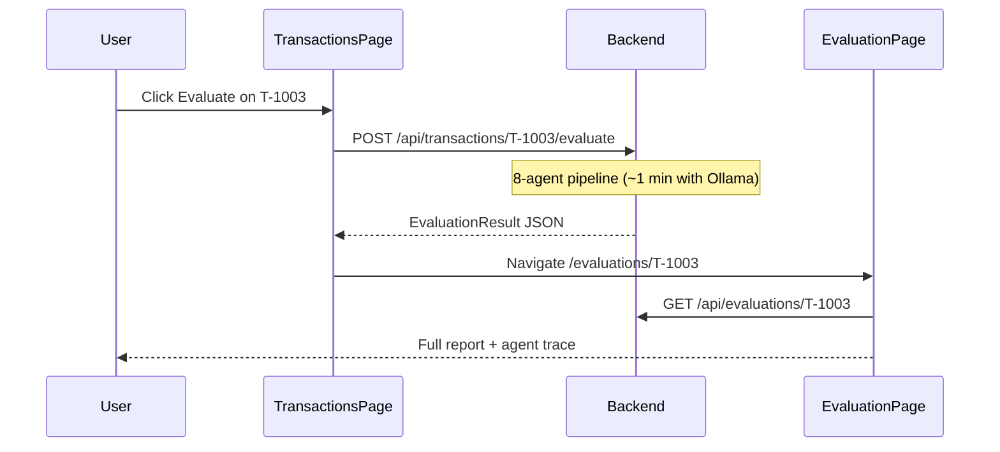

# Web — React + Vite

> **Demo setup:** use the root **[README.md](../README.md)** — one guide to init everything.

Single-page application for the BCP multi-agent fraud detection system. All user-facing text is in **English**.

---

## Prerequisites

- Node.js **20+**
- Backend API running at `http://localhost:8000` (see root [README.md](../README.md))
- `web/.env` with `VITE_API_URL=http://localhost:8000`

---

## Quick start

```bash
cd web
cp .env.example .env
npm install
npm run dev
```

Open **[http://localhost:5173](http://localhost:5173)**

Production build:

```bash
npm run build    # output → dist/
npm run preview  # serve dist locally
```

---

## Tech stack

| Piece | Library |
|-------|---------|
| UI | React 18 + TypeScript |
| Build | Vite 6 |
| Routing | React Router 6 |
| Server state | TanStack Query |
| Styling | Tailwind CSS |
| Tests | Vitest + Testing Library + MSW |

---

## Application structure

```
web/src/
├── pages/           # Route-level screens
├── components/      # Reusable UI (tables, cards, timeline)
├── hooks/           # useQueries, useMutations
├── api/client.ts    # Single HTTP client (fetch wrapper)
├── types/           # DTOs matching backend schemas
└── lib/             # Formatters, agent status, policy helpers
```

Data flow: **Page → hook → api/client → FastAPI**. Components do not call `fetch` directly.

---

## Routes & pages

| Nav label | Route | Page | Purpose |
|-----------|-------|------|---------|
| Dashboard | `/` | `DashboardPage` | Stats: total transactions, pending HITL, quick links |
| Transactions | `/transactions` | `TransactionsPage` | Table of all transactions; evaluate one or bulk |
| Insert | `/insert` | `InsertPage` | Simulator — insert SIM-* rows from templates |
| HITL Queue | `/hitl` | `HitlPage` | Human review queue |
| Audit Trail | `/audit`, `/audit/:id` | `AuditPage` | Search by transaction ID; full forensic view |

Hidden route (no nav link): **Evaluation** at `/evaluations/:transactionId` — opened from Transactions or Audit.

Legacy redirect: `/simulator` → `/insert`.

---

## User flows

### 1. Evaluate a transaction



- **Evaluate** runs the full pipeline (LLM calls for Debate + Explainability).
- **View** opens an already-evaluated transaction without re-running.

### 2. Evaluate all pending

- Button on Transactions when unevaluated rows exist.
- Calls `POST /api/transactions/evaluate-pending` (single backend request).
- Shows progress banner; **Cancel** aborts the browser wait (server may still finish).
- Partial errors listed if some transactions fail.

### 3. Insert simulator transaction

1. Go to **Insert**.
2. Pick a template (e.g. T-1001) or **Insert next**.
3. New row appears in Transactions as `SIM-T-1001-…`.
4. Click **Evaluate** to run the pipeline.

Insert only writes to MongoDB — **no LLM** until Evaluate.

### 4. HITL review

Cases are created automatically when:

- Decision is `ESCALATE_TO_HUMAN`, or
- Risk score (`confidence`) ≥ 0.5

On **HITL Queue**:

1. Review case card (transaction, original decision, risk bar).
2. Add optional reviewer note.
3. Click **APPROVED**, **REJECTED**, or **ESCALATED**.
4. Event recorded in audit trail.

### 5. Audit trail

1. Go to **Audit Trail**.
2. Enter transaction ID (e.g. `T-1004`) → **Search**.
3. View sections:
   - **Profile comparison** — amount, country, device, hour vs customer baseline
   - **Policy thresholds** — FP-01…FP-04 triggered or not
   - **Agent pipeline status** — Passed / Flagged / Failed per agent
   - **Agent step details** — findings per agent
   - **Audit explanation** — narrative for investigators
   - **System & HITL events** — ingestion, case created/resolved

Link **View evaluation report** opens the Evaluation page.

---

## Evaluation page sections

| Section | Description |
|---------|-------------|
| Transaction under review | Amount, customer, merchant, profile comparison |
| Evaluation result | Decision badge, risk score (0–1, higher = riskier) |
| Customer explanation | Spanish text for the bank customer |
| Audit explanation | English narrative with policy citations |
| Detected signals | Flags from Context + Behavioral agents |
| Policies & evidence | Matched FP-* rules, RAG citations, web hits |
| Multi-agent pipeline | Visual flow across 4 phases |
| Step-by-step agent trace | Color-coded cards per agent |

### Agent status colors

| Badge | Meaning |
|-------|---------|
| Clear (green) | No concerns at this step |
| Review (amber) | Flags or moderate risk |
| High risk (red) | Strong fraud indicators |
| Info (gray) | Non-decisive step (e.g. Debate) |

---

## Environment variables

| Variable | Default | Description |
|----------|---------|-------------|
| `VITE_API_URL` | `http://localhost:8000` | Backend base URL (build-time) |

For Azure Static Web Apps, set `VITE_API_URL` to the Container App URL before `npm run build`.

---

## API client

All HTTP calls go through `src/api/client.ts`:

```typescript
import { api } from "@/api/client";

await api.listTransactions();
await api.evaluateTransaction("T-1003");
await api.getEvaluation("T-1003");
await api.getHitlQueue();
await api.getAuditTrail("T-1003");
```

Errors throw `ApiError` with HTTP status. Cancelled bulk requests throw `ApiAbortError`.

---

## Tests

```bash
npm run test           # run once
npm run test:coverage  # ≥70% threshold (vite.config.ts)
npm run lint
npm run build
```

MSW mocks API responses in `src/test/mocks/handlers.ts` — unit tests do not hit the real backend.

| Area | Location |
|------|----------|
| Pages | `src/pages/__tests__/` |
| Components | `src/components/__tests__/` |
| Hooks | `src/hooks/__tests__/` |
| Lib helpers | `src/lib/__tests__/` |

---

## Troubleshooting

| Issue | Fix |
|-------|-----|
| Blank page / network errors | Check backend on `:8000` and `VITE_API_URL` |
| Evaluate hangs | Ollama slow or down — start `ollama serve` or set `LLM_MOCK=true` |
| CORS errors | Add frontend origin to `CORS_ORIGINS` in root `.env` |
| No transactions | Run `python -m scripts.seed_data` in backend |
| Audit 404 | Evaluate the transaction first |

---

## Related docs

- [Root README](../README.md) — full stack setup
- [Backend README](../backend/README.md) — API endpoints
- `.cursor/rules/web-frontend.mdc` — architecture conventions
